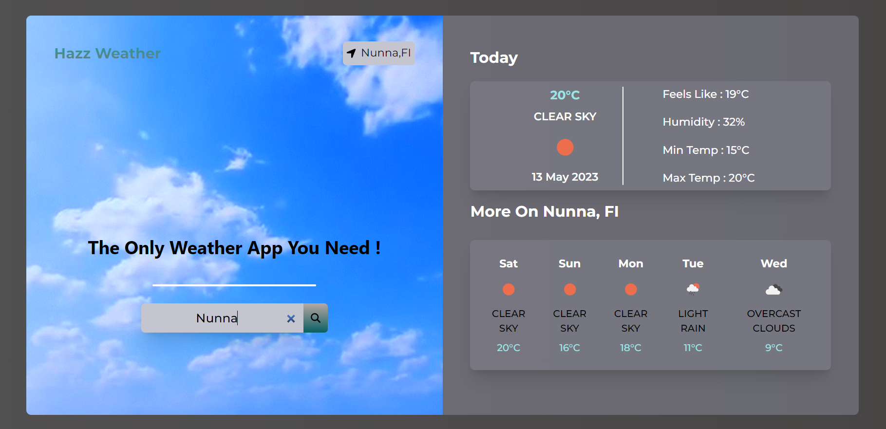

# [Weather@Live](https://weather-app-ineuroninternship1.netlify.app/)

## About

Weather Application created using ReactJS and APIs provided by openweathermap.org.

## Features

- Real-time weather information
- Accurate weather data
- Location-based weather information
- User-friendly interface
- Search functionality for specific cities
- Displays the present weather conditions (Temperature, Humidity, Cloud Cover) along with forecasts for the future.
- Animation According To Weather Condition.

## Technologies Used

- ReactJS
- Tailwind CSS
- OpenWeatherMap API

## Installation

1. Clone the repository to your local machine.
2. Install dependencies by running `npm install` in the terminal.
3. Run `npm start` in the terminal to start the app in development mode.

## Usage

1. Open the app in your web browser.
2. View the nearby weather updates based on your current location.
3. Enter a city name in the search bar to view weather updates for that city.
